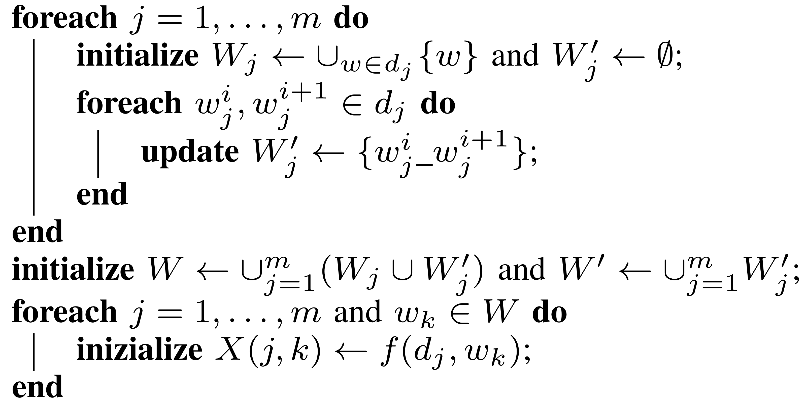
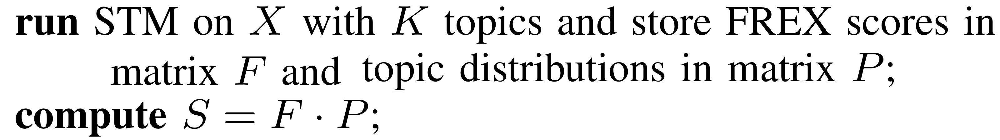
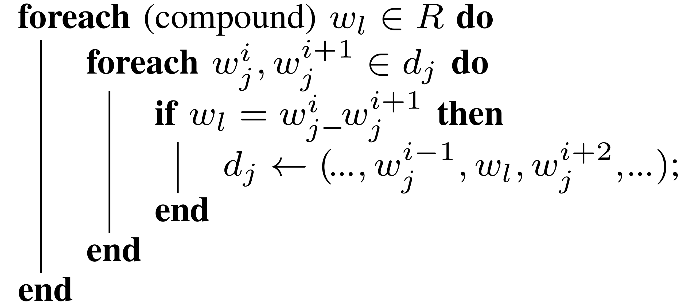
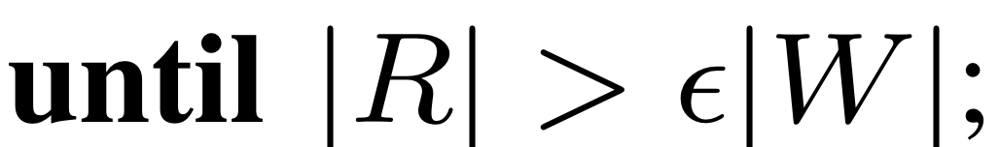
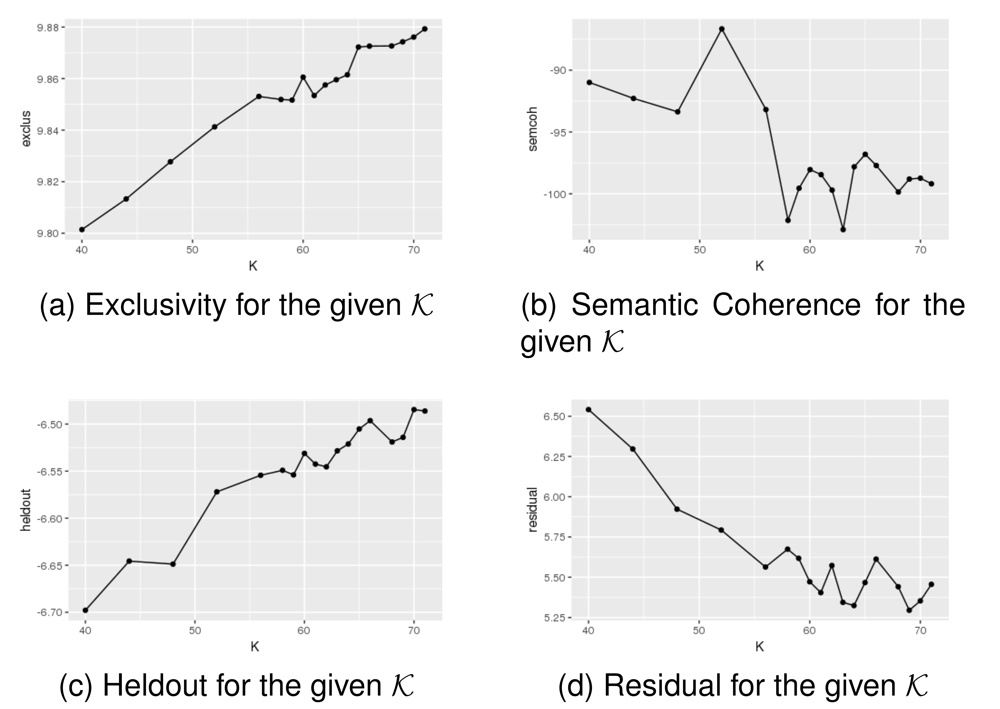
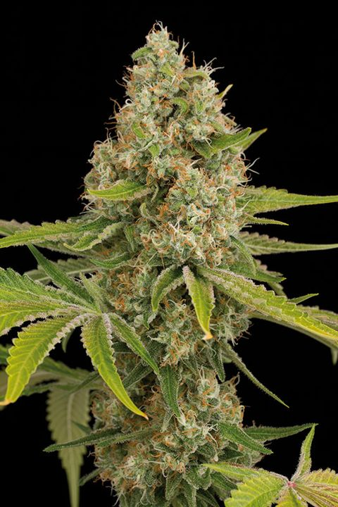

## Just a Summary{data-background="img/mars.gif"}

- Scope: Help Italian Investigators on ToR Drugs Marketplaces
 
- Using Topic Model:

    + Base  Structural Topic Model
     
    + Our Extension : **from Bag of Words to Bag of N-grams**
     
    + The Algorithm
 
- Some Results
 
- Conclusions

# Scope: Help Italian Investigators on ToR Drugs Marketplaces  {data-background="img/sherlok_scope.gif"}

## IANCIS ISEC Project  {data-background="img/spiderman.gif"}
<small>

- Indexing of Anonimous Networks for Crime Information Search
 
- We performed a complete crawling
of four famous ToR drug marketplaces: Alphabay, Crypto Market, East India and Nucleus
 
- Marketplaces composed of pages advertising some item for sale
 and grouped by category
 
- We generated a corpus of documents for which covariate information (the market and the category) are immediately available
 
- Goals for the IANCIS project:

    1. Understand if there is any difference between markets/categories
     
    2. Verify the presence of context-specific idioms and a topical slang
 
- Topic Model (TM) can be a natural choice in order to analyze the corpus
 

</small>

# Our Choice: Structural Topic Model (STM)  {data-background="img/STM_Scheme.png" data-center="false"}

## Structural Topic Model (STM) {data-background="img/STM_Scheme.png" data-background-position="bottom" data-background-size="30%"}

<!-- > Structural Topic Modelling is a recent extension to TM  -->

> - STM allows incorporating tags, categories, metadata and other information accompanying the text archive
 
> - STM uses covariate information to parametrize the prior
distributions to potentially affect both topical prevalence and topical content. 

 Goal number 1 

 
> - STM use the Bag Of Word approach 

 ~~Goal number 2~~ 

 
<!-- <aside class="notes"> -->
<!-- This is my note. -->

<!-- - It can contain Markdown -->
<!-- - like this list -->

<!-- </aside>   -->

# Bag Of Words (BOW) Recap {data-background="img/BOW_2.gif"}

## Bag Of Words (BOW) Recap {data-background="img/BOW_2.gif" data-background-position="right" data-background-size="10%"}

<small>

> -  Bag Of Words (BOW) paradigm: documents are viewed as a multisets of words, ignoring grammar and syntax
 
> - Only focusing on unigrams frequencies
 
> -  Inability to detect topical multi-word expressions (phrasemes)  
> - Difficulty in visualizing/interpreting the obtained topics
 
> - For example we can build a corpus of texts speaking a lot of:
United States, United Arab Emirates, United Kingdom, United Nations
 
> - Running a topic (1-gram) model can generate topic like that:
united, president, election, arab, nations, states, kingdom, emirates
 
> - Is united referring to? UAE? USA? UK? UN?
 
> - Taking into account phrasemes can generate topic content like that: united_arab_emirates, arab_nations, president_election, kingdom

</small>

# Our Extended STM {data-background="img/Extended_STM.gif"}

## Our Extended STM {data-background="img/Extended_STM.gif" data-background-position="right bottom" data-background-size="20%"}

> - **The rationale**: adding an idiom to the dictionary helps topics extraction and characterization only as long as the
idiom and its components express different concepts that are
relevant to different topics
 
>- **In practice**: standard STM without covariates modeling is
iteratively used to detect topic-relevant token-pairs which are
merged into a **single extended_word**, up to a moment when no more
relevant compound terms emerge
 
> - From Bag Of Words to **Bag Of n-grams** $(n \in \{1,2\})$

# The Algorithm {data-background="img/Algorithm_ICSC_00_Overall.png" data-background-position="left" data-background-size="45%"}

## The Algorithm (running...) {data-background="img/running.gif" data-background-position="right bottom" data-background-size="15%"}

<small>

- $D = \{d_1, . . . , d_m\}$ is our corpus of $m$ documents
 
- Step zero is preprocessing:
     
    1. removing special characters and forcing to lowercase
     
    2. tokenizing the string into words
     
    3. removing stop-words (i.e., function words, auxiliary/lexical verbs, adverbs/adjectives, file extensions, ...)
     
    4. Each document is formatted as an ordered list $d_j = (w_j^1,\ldots,w_j^{n_j})$

</small>

## The Algorithm (running...) {data-background="img/running.gif" data-background-position="right bottom" data-background-size="15%"}

<small>

- Given two consecutive tokens  $w_1$ and $w_2$, $w_1\_w_2$ denotes their concatenation
($w_1$ and/or $w_2$ may be the concatenation
of any number of words)
 

- The dictionary $W$ is the union of the tokens and their concatenation
 

- $f(d_j,w)$ denotes the tf-idf of
(compound) word $w$ in document $d_j$

</small>

   
   
  

## The Algorithm (running...) {data-background="img/running.gif" data-background-position="right bottom" data-background-size="15%"}

 
<small>

- Let $|W|$ be the total number of tokens and $|D|$ the number of documents
 
- $F$ is the $|W| × K$ matrix whose entry F_{l,t} is the FREX score of token $w_l$ with respect to topic $t$
 
- $P$ is the $K × |D|$ matrix whose entry $P_{t,j}$ is the probability of topic $t$ appearing in document $d_j$
 
- The product $S = F·P$ yields a $|W| × |D|$ matrix whose entry $S_{l,j}$ is a score of the relevance of word $w_l$ in document $d_j$

</small>

## The Algorithm (running...) {data-background="img/running.gif" data-background-position="right bottom" data-background-size="15%"}

 
Compound tokens selection
  
<small>
Using empirical considerations for our corpus 
$p_{min} = 0.01$, $FREX_{min} = 0.95$  and then
 
$s_{min} = p_{min} \cdot FREX_{min} = 9.5 \cdot 10^{-3}$
</small>
    
Dictionary update

  
  

## The Algorithm (...end) {data-background="img/running_end.gif" data-background-position="bottom" data-background-size="25%"}

Using empirical considerations, for our corpus $\epsilon |W| = 100$

# Results {data-background="img/coming_soon.gif"}

<!-- ## Our Corpus {data-background="img/name_of_the_rose.gif"} -->

## Our Corpus {data-background="img/livraria-lello-stairs.jpg"}

-----------------------------
    Market          # of pages
----------------- ----------------
    Nucleus           8902

   Alphabay           7472

 Crypto Market        2435

  East India          1682

  **Total Pages**     20491
---------------------------------

## Running Final STM with Covariate: Choosing $K$ {data-background="img/Run_Forrest.gif"}

  

<small>

- There is not a *true* value for $K$

- It depends on the objective of the study

- *searchK* function in STM use 4 different tests: exclusivity, semantic coherence, heldout, and residual.

- We used *searchK* on the set $\mathcal{K} = \{40, 44, 48, 52, 56, 58, 59, 60, 61, 62, 63, 64, 65, 66, 68, 69, 70, 71\}$

- Choice of $\mathcal{K}$: to explore a relatively
wide range of values larger than 39 (the number of
categories):
    + to assess the ability of Topic Modelling to (automatically) produce a refined characterization of the dataset
    + to extract cross-category topics such as
“shipment” or “drugs effects”

</small>

## {data-background="img/Run_Forrest.gif" data-background-transition="convex"}

## Running Final STM with Covariate: Choosing $K$ {data-background="img/Run_Forrest.gif" data-background-transition="convex"}

{width=60%}

We decided to set K = 65 as it seems
to provide a reasonable trade-off among the four metrics

#  {data-background="img/Breaking_Bad_Ice_Meth.png" data-background-transition="convex"}

<!-- Background thanks to http://sbll.org/breakingbad/ -->

## Topic 30: Methamphetamine {data-background="img/Breaking_Bad_None.png" data-background-transition="convex"}

- The highest score tokens were:

    + ice, meth, **crystal_meth**, shards
    + **crystal_methamphetamine**
    + **0.5g_crystal_methamphetamine**

 {width=70%}

- Methamphetamine was tagged only in Crypto Market with frequency of 0.022

- Using the *estimateEffect*:

    + in Nucleus (0.0218) the topic is 2 times more prevalent respect the others (0.0114) 
(it is statistically significant!)

#  {data-background="img/Breaking_Bad_Hashish_Sativa.png" data-background-transition="convex"}

<!-- Background thanks to http://sbll.org/breakingbad/ -->

## Cannabis and Hashish Topics {data-background="img/Breaking_Bad_None.png" data-background-transition="convex"}

<small>

- $7$ different topics: $1, 14, 22, 46, 50, 54, 56$

- Zoom to the $56$ which highest score tokens were:

    + **shatter_pull_snap**, **sour_strawberry_diesel**
    + **og_kush**, **ak_strain**, indoor, scout, hybrid, indica
    + sativa, **chemicalscannabis_hashishbuds**, **content_thc_cbd**, **14g_black_diamond**

- Using the *estimateEffect*:

    + in East India the topic $56$ show a $30\%$ increase respect to the others
(it is statistically significant!)

</small>

 {width=45%}
 {width=45%}

# Conclusions and Future Works {data-background="img/2001_ending.gif"}

## Conclusions {data-background="img/inception_end.gif"}

> - As an exploratory approach we opted for an ad-hoc heuristic based on iteratively apply standard STM to detect topic-relevant term-pairs and merge them into a single extended-word

> - The coherence and the intelligibility of the obtained topics were significantly enhanced

> - Through a fine-grained and cross-market analysis of the thematic organization of the corpus we were able to gain relevant information about drug trade on ToR that goes well beyond those provided by the already available high level content classification

## Future Works {data-background="img/time_machine.gif"}

> - Extend the *a priori* joint distributions to the N-grams and to the skip-grams
 
> - Increase performances
 
> - Now all is running on CPU on R -> GPU version  also using R (RCuda package)

# ... this is the END {data-background="img/truman_show_end.gif"}

## THANKS!!! {data-background="img/truman_show_end.gif"}

[github.com/santoroma/ICSC-2018_Presentation_82](http://github.com/santoroma/ICSC-2018_Presentation_82)

